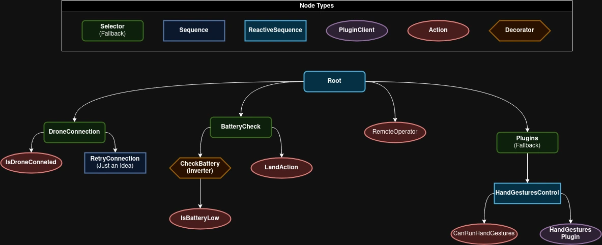

# Tello Behavior Tree

The `tello_bt` package implements a behavior tree (BT) for managing and executing plugins that define various behaviors for the Tello drone. This package uses the `py-trees` library to structure and run the behavior tree.

## What is a Behavior Tree?

A behavior tree is a model that organizes defined behaviors into a tree structure, allowing them to be executed (or "ticked") in each iteration. While similar to a Finite State Machine (FSM), a behavior tree supports more complex scenarios with greater flexibility and simplicity.

In `py_trees`, a behavior tree is built using nodes, decorators, and composites, each with specific functionality to control the flow of execution. For more information, visit [py_trees documentation](https://py-trees.readthedocs.io/en/devel/)

---

### Common Nodes Used

#### Action Nodes

Action nodes perform specific tasks when ticked. They execute actions and return a status (`SUCCESS`, `FAILURE`, or `RUNNING`).

- `py_trees.behaviour.Behaviour`: The base class for any node you desire to create which does not require ROS.
- `tello_bt.nodes.actions.Action`: The base class for any node you desire to create which relies on ROS.
- `tello_bt.nodes.PluginClient`: A node which is used to execute a plugin.

#### Condition Nodes

- `tello_bt.nodes.conditionals.CanRunPlugin`: A conditional node which can be used to check if a plugin is currently selected to run.

Condition nodes check a condition and return `SUCCESS` if it is met, otherwise `FAILURE`.

---

### Common Decorators Used

Decorators modify the behavior of their child node based on specific rules or conditions.

- **`py_trees.decorators.Inverter`**: Inverts the result of the child node (e.g., `SUCCESS` becomes `FAILURE`).

---

### Common Composites Used

Composite nodes are used to group multiple child nodes and control their execution flow.

- **`py_trees.composites.Sequence`**: Executes its children in order until one fails. Returns:
    
    - `SUCCESS` if all children succeed.
    - `FAILURE` if any child fails.
    - `RUNNING` if a child is still running.

- **`py_trees.composites.Selector`**: Executes its children in order until one succeeds. Returns:

    - `SUCCESS` if any child succeeds.
    - `FAILURE` if all children fail.
    - `RUNNING` if a child is still running.

- **`py_trees.composites.Parallel`**: Executes all children simultaneously. Returns:
    - `SUCCESS` if the required number of children succeed.
    - `FAILURE` if too many children fail or if required conditions are not met.

---

## Creating a Behavior Tree

By default, the behavior tree used is `tello_bt.bt.DefaultBT`. To create your own custom behavior tree, follow these steps:

1. **Create a New File**: Add a new Python file in the `tello_bt.bt` directory and name it appropriately.
2. **Define the `bootstrap` Function**:
    - Your file must define a function named `bootstrap(ros_node: rclpy.Node) -> py_trees.behaviour.Behaviour`.
       - This function will be called by the BT ROS node to load your behavior tree.
       - It should return the root of your tree.
3. **Update Parameters**: Modify the parameter file to set the `bt_name` field to your file name (without the `.py` extension).

### Example

Below is a simple example of a behavior tree with a sequence node and a decorator.

#### Python Code

```python title="tello_bt/bt/simple_bt.py"
import py_trees
from rclpy.node import Node

def create_tree(): # Leaf nodes
    success_node = py_trees.behaviours.Success(name="Always Succeed")
    failure_node = py_trees.behaviours.Failure(name="Always Fail")

    # Decorator
    invert_failure = py_trees.decorators.Inverter(child=failure_node)

    # Composite
    sequence = py_trees.composites.Sequence(name="Simple Sequence")
    sequence.add_children([success_node, invert_failure])

    return sequence

def bootstrap(ros_node: Node) -> py_trees.behavior.Behaviour:
    tree = create_tree()
    return tree
```

#### Parameters File

```yaml title="config/params.yaml"
bt_server:
  ros__parameters:
    bt_name: simple_bt
```

## Explaining Default BT

Below is the graphical representation of the `DefaultBT` behavior tree.

!!! note

    - **Reactive sequence** is a sequence without memory, meaning that it will always start from the first child.
    - **Sequence** has memory, meaning if one of it's children returns `RUNNING`, the next time it ticks, it will tick directly that child.

{ align=center }

The structure and purpose of each part of the tree are as follows:

---

### Root: `DefaultBT`

- **Type**: Sequence (no memory)
- **Purpose**: Ensures all the children (subsystems) are checked or executed in order.

### 1. **Drone Connection Checker**

- **Type**: Selector (no memory)
- **Child**: `IsDroneConnected`
- **Purpose**: Verifies if the drone is connected.
    - If the connection is successful (`SUCCESS`), it moves to the next step.
    - If the connection is not established (`FAILURE`), the tree stops ticking and the sequence fails.

### 2. **Battery Checker**

- **Type**: Selector (no memory)
- **Children**:
    - **`IsBatteryLow`**: Checks if the battery is low. If it is, returns `SUCCESS`.
    - **Inverter** (decorator) → **`LandAction`**: If the battery is not low, the decorator inverts the result of the `LandAction`.
        - The `LandAction` would normally return `FAILURE` (since landing is not required when the battery is okay), but the `Inverter` converts it to `SUCCESS`.
- **Purpose**: Ensures that if the battery is low, the drone lands safely. Otherwise, it allows the behavior tree to continue execution.

### 3. **Remote Operator**

- **Type**: Action Node
- **Name**: `RemoteOperator`
- **Purpose**: Checks keyboard input from `tello_control_station` and change selected plugin from blackboard to hand gestures plugin if selected.
    - Alawas returns `SUCCESS`

### 4. **Plugins Selector**

- **Type**: Selector (no memory)
- **Children**:
  
    1. **Hand Gestures Control** (no memory):
        - **`CanRunPlugin`**: Checks if the "landmark_detector_node" plugin is enabled and can run.
         - **`PluginClient`**: Executes the plugin responsible for hand gesture control, enabling drone interaction using visual gestures.

- **Purpose**: Extends the drone's capabilities by enabling additional plugins, such as gesture control. If no plugin is active or available, this branch fails, but the rest of the tree can continue.

---

```python title="tello_bt/bt/default_bt.py"
# ...
class DefaultBT(py_trees.composites.Sequence):
    # ...
    def build_tree(self):
        drone_connection = py_trees.composites.Selector(
            "DroneConnection",
            memory=False,
            children=[
                IsDroneConnected("IsDroneConnected"),
            ],
        )

        battery_checker = py_trees.composites.Selector(
            "BatteryChecker",
            memory=False,
            children=[
                IsBatteryLow("IsBatteryLow", self.node),
                py_trees.decorators.Inverter(
                    "LandActionInverter", LandAction("LandAction", self.node)
                ),
            ],
        )

        remote_operator = RemoteOperator("RemoteOperator", self.node)

        plugins = py_trees.composites.Selector(
            "Plugins",
            memory=False,
            children=[
                py_trees.composites.Sequence(
                    "HandGesturesControl",
                    memory=False,
                    children=[
                        CanRunPlugin("CanRunHandGestures", "landmark_detector_node"),
                        PluginClient(
                            "HandGesturesPlugin", "landmark_detector_node", self.node
                        ),
                    ],
                )
            ],
        )

        self.add_children([drone_connection, battery_checker, remote_operator, plugins])


def bootstrap(ros_node: Node) -> py_trees.behaviour.Behaviour:
    return DefaultBT(ros_node)
```
